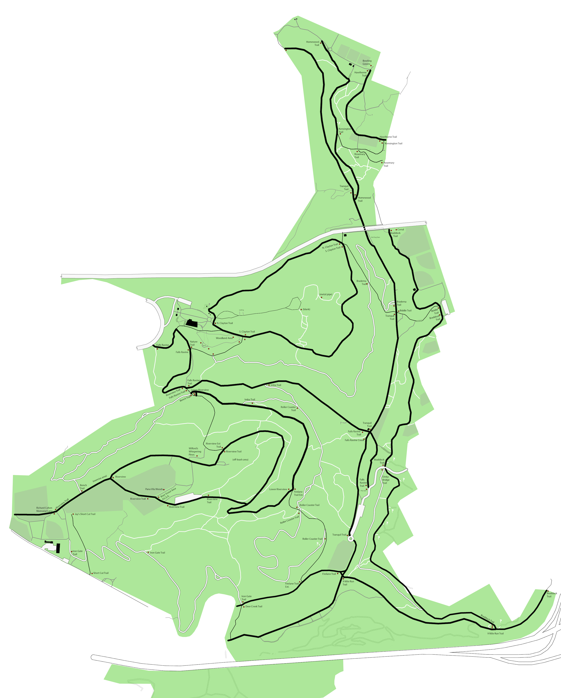

# MAPS-Frick-Park

Fall 2020 graphic design project to develop a better map for Frick Park in Pittsburgh, PA

## Project Summary

Frick Park is one of my favorite places in Pittsburgh. I failed to find a single map that contains all of the parks
walking and biking trails, so I decided to create my own. I built up my map by overlaying a number of existing maps and
adding in new trails that weren't on previous maps during my walks throughout the park.

All illustrative work was completed in Photoshop.

## Map

## Next Steps
- Scale text to a size appropriate for printing out maps
- Add a legend for line types